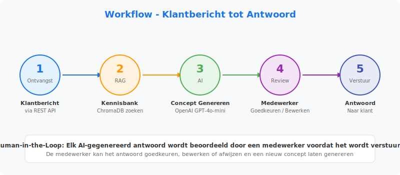
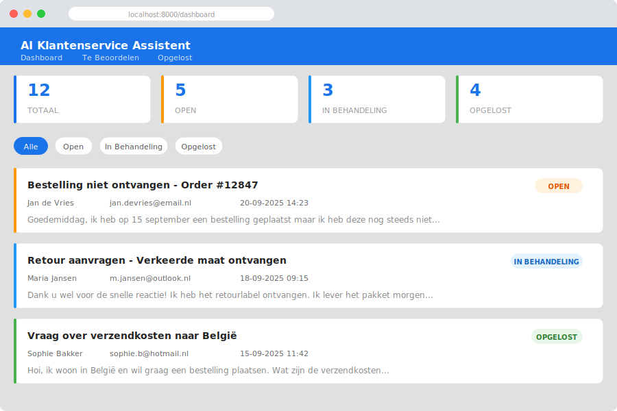

# AI Klantenservice Assistent

An AI-powered customer support assistant for e-commerce platforms that generates smart draft replies using OpenAI and a RAG knowledge base. Designed for Dutch-language customer communication with a human-in-the-loop approval workflow.


---

## Overview

This system helps customer support teams handle inquiries more efficiently by:

- **Reading** incoming customer messages via REST API
- **Searching** a knowledge base (FAQ, shipping & return policies) using RAG
- **Generating** AI-powered draft replies in natural Dutch
- **Reviewing** drafts through a web dashboard before sending
- **Learning** from historical customer conversations

### System Architecture


### Workflow



### Dashboard Preview



---

## Features

| Feature | Description |
|---------|-------------|
| **AI Draft Generation** | Generates context-aware replies using OpenAI GPT-4o-mini |
| **RAG Knowledge Base** | ChromaDB vector store with FAQ, shipping & return policies |
| **Human Approval** | Review, edit, approve or reject AI drafts before sending |
| **Dutch Language** | All prompts and UI optimized for Dutch communication |
| **Message Categorization** | Auto-categorizes messages by topic and urgency |
| **Conversation History** | Tracks full conversation threads with customer context |
| **Web Dashboard** | Jinja2-based UI for managing conversations and drafts |
| **REST API** | Full API for integration with existing CRM/helpdesk tools |

---

## Tech Stack

- **Backend**: Python 3.11+ / FastAPI
- **AI**: OpenAI API (GPT-4o-mini)
- **Vector DB**: ChromaDB (RAG pipeline)
- **Database**: SQLite + SQLAlchemy
- **Frontend**: Jinja2 Templates + Vanilla CSS/JS
- **Validation**: Pydantic v2

---

## Quick Start

### 1. Clone & Install

```bash
git clone https://github.com/your-username/AI-Customer-Support.git
cd AI-Customer-Support
python -m venv venv
source venv/bin/activate  # Windows: venv\Scripts\activate
pip install -r requirements.txt
```

### 2. Configure

```bash
cp .env.example .env
# Edit .env and add your OpenAI API key
```

### 3. Load Knowledge Base & Seed Data

```bash
python scripts/ingest_knowledge.py
python scripts/seed_data.py
```

### 4. Run

```bash
uvicorn app.main:app --reload
```

Visit:
- **Dashboard**: [http://localhost:8000/dashboard](http://localhost:8000/dashboard)
- **API Docs**: [http://localhost:8000/docs](http://localhost:8000/docs)

---

## API Endpoints

### Messages
| Method | Endpoint | Description |
|--------|----------|-------------|
| `POST` | `/api/messages/` | Submit a new customer message |
| `GET` | `/api/messages/conversations` | List all conversations |
| `GET` | `/api/messages/conversations/{id}` | Get conversation details |
| `POST` | `/api/messages/{id}/reply` | Add customer follow-up |

### Drafts
| Method | Endpoint | Description |
|--------|----------|-------------|
| `POST` | `/api/drafts/generate/{conversation_id}` | Generate AI draft reply |
| `GET` | `/api/drafts/{conversation_id}` | Get drafts for conversation |
| `POST` | `/api/drafts/{id}/approve` | Approve and send draft |
| `POST` | `/api/drafts/{id}/reject` | Reject draft |
| `POST` | `/api/drafts/{id}/edit` | Edit draft content |
| `GET` | `/api/drafts/pending/all` | List all pending drafts |

### Knowledge Base
| Method | Endpoint | Description |
|--------|----------|-------------|
| `POST` | `/api/knowledge/documents` | Upload a knowledge document |
| `GET` | `/api/knowledge/documents` | List all documents |
| `GET` | `/api/knowledge/search?query=...` | Search knowledge base |

### System
| Method | Endpoint | Description |
|--------|----------|-------------|
| `GET` | `/health` | Health check |
| `GET` | `/api/status` | API status |

---

## Example Usage

### Submit a customer message

```bash
curl -X POST http://localhost:8000/api/messages/ \
  -H "Content-Type: application/json" \
  -d '{
    "customer_name": "Jan de Vries",
    "customer_email": "jan@voorbeeld.nl",
    "subject": "Vraag over retourbeleid",
    "content": "Hoe lang heb ik om een product te retourneren?"
  }'
```

### Generate an AI draft reply

```bash
curl -X POST http://localhost:8000/api/drafts/generate/1
```

### Approve a draft

```bash
curl -X POST "http://localhost:8000/api/drafts/1/approve?reviewed_by=agent_name"
```

---

## Project Structure

```
AI-Customer-Support/
├── app/
│   ├── main.py              # FastAPI application + dashboard routes
│   ├── config.py             # Environment configuration
│   ├── database.py           # SQLite database setup
│   ├── models.py             # SQLAlchemy ORM models
│   ├── schemas.py            # Pydantic request/response schemas
│   ├── routers/
│   │   ├── messages.py       # Customer message endpoints
│   │   ├── drafts.py         # Draft reply endpoints
│   │   └── knowledge.py      # Knowledge base endpoints
│   ├── services/
│   │   ├── ai_service.py     # OpenAI integration & prompts
│   │   ├── rag_service.py    # ChromaDB RAG pipeline
│   │   └── approval_service.py  # Human approval workflow
│   └── templates/            # Jinja2 dashboard templates
├── knowledge_base/           # FAQ, shipping & return policies (Dutch)
├── scripts/                  # Seed data & ingestion scripts
├── static/                   # CSS & images
├── .env.example              # Environment variable template
└── requirements.txt          # Python dependencies
```

---

## Knowledge Base

The RAG pipeline uses the following Dutch-language documents:

- **`faq.md`** — Veelgestelde vragen (ordering, payment, accounts, products)
- **`shipping_policy.md`** — Verzendbeleid (costs, delivery times, carriers)
- **`return_policy.md`** — Retourbeleid (return conditions, process, refunds)

You can add custom documents via the API or by placing files in `knowledge_base/` and running the ingestion script.

---

## Configuration

| Variable | Default | Description |
|----------|---------|-------------|
| `OPENAI_API_KEY` | — | Your OpenAI API key |
| `DATABASE_URL` | `sqlite:///./support.db` | Database connection string |
| `CHROMA_PERSIST_DIR` | `./chroma_data` | ChromaDB storage directory |
| `APP_TITLE` | `AI Klantenservice Assistent` | Application title |
| `APP_HOST` | `0.0.0.0` | Server host |
| `APP_PORT` | `8000` | Server port |

---

## License

This project is licensed under the MIT License.
